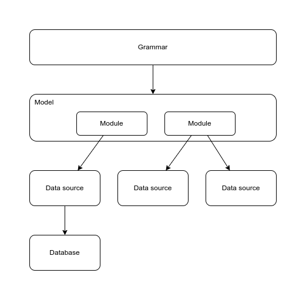

# Model and Database

You could tell the grammar to talk to a database directly, but this would put much of the complexity in the grammar, and it is of itself already a source of complexity. It would also make it impossible to reuse the grammar in other domains.

This library puts a layer between the application and the database: the model. The model contains the relations. It delegates the implementation of the relations through modules. Each model may talk to a data source (possibly more), which can take any form tabular data, most commonly a database.

Each layer has its own language. The grammar has natural language (English, French). The model has the domain language of relations and entities, which are here expressed in English, but any other language is fine. The data sources each have their own naming conventions.

## Model: domain and interpretation

We won't use formal logic, but we will borrow its idea of a model. A __model__ represents part of reality. It has a __domain__, some entities, relations and attributes, and an __interpretation__. The domain contains a number of instances (things). Relations and attributes specify how the instances in the domain interact. The interpretation is a function that maps the entities and relations to the domain.

In this library, the domain is formed by the rows in a database, the files of a file system, or any other piece of data. The interpretation is formed by functions that map an entity or relation to the id's in a database, to filenames, or any other identifier.

The grammar uses the model as an abstraction to decouple it from the database.

__types__, or in linguistic literature: __sorts__, are the basic concepts of a model: users, customers, persons, products, orders, fields, groups, blocks, etc. Each entity is part of another entity, which is called its parent. For example: a town is a place; a customer is a person; a pyramid is a block. Thus, entities form a __hierarchy__. They are the meaning of nouns.

__relations__ are connections between entities: borders, is_behind, is_taller. Relations take 2 or more entity arguments. They provide the meaning of verbs and relational expressions.

It's good to make these concepts explicit at the start of a new application. Give them names that are used by the people that work with the application, rather than, say, the names used in the database, though there will be a large overlap.

## Module

The model is a plugin of the model that provides implementations of relations. For each predicate it supports, it provides the code to implement it.

Here's stripped down module definition for the Chat-80 demo, with its relations.

~~~python
class Chat80Module(SomeModule):

    ds: SomeDataSource

    def __init__(self, data_source: SomeDataSource) -> None:

        self.ds = data_source
        self.relations = {
            "river": Relation(query_function=self.simple_entity,
            "country": Relation(query_function=self.simple_entity,
            "capital": Relation(query_function=self.capital,
            "borders": Relation(query_function=self.borders,
            "resolve_name": Relation(query_function=self.resolve_name,
            "of": Relation(query_function=self.of,
        }

    def simple_entity(self, values: list, context: ExecutionContext) -> list[list]:
        return self.ds.select(context.predicate, ["id"], values)

~~~

The adapter also implements the interpretations that map the domain-names to the database-names (more general: data source names).

## Relation

The relation of a module has the following properties:

* query_function
* write_function
* relation_size
* argument_sizes
* attributes

Not all of them are used in a single relation. There are a few use cases:

In the simplest case, a relation only has a `query_function` that point to the method that implements the read aspect of the relation.

~~~python
"contains": Relation(query_function=self.contains),
~~~

In this example, the function `contains` looks like this:

~~~python
def contains(self, values: list, context: ExecutionContext) -> list[list]:
    return self.ds.select("contains", ["whole", "part"], values)
~~~

it just delegates the call to the data source that adapts to the database.

The method may contain any form of Python code to implement the relation. It can perform a calculation, start a new process, look up a value, call an API, anything you may need. The result of the function is a list of results. Each result is also a list, and it contains one value for each of the arguments of the relation. As `contains` has two arguments, the result should have two values, in the argument order of the relation. If the value doesn't matter, use `None`.

A query function may be accompanied by its relation size and argument sizes.

~~~python
"borders": Relation(query_function=self.borders, relation_size=LARGE, argument_sizes=[MEDIUM, MEDIUM]),
~~~

These sizes are used by the query optimizer of Composer to determine the best order of execution. When left out, the algorithm will not reorder such atom. Adding size information may do wonders for performance, but only some relations are suitable for this purpose. Relations that access the database are especially well suited. `relation_size` is the number of rows in the table. You can be exact in this, or use one of the predefined constants that provide an order of magnitude. The `argument sizes` contain the cardinality of a column in the database. This is the number of different values.

Relations that are writable to the database implement the `write_function`. Writing to the database is currently only available for the in-memory database. This will change in a future release. Implement it only for relations that need to e written to a database.

In ordinary cases you don't need to specify the `attributes` of a relation. The only current use is by the SimpleMemoryModule to map relations to the datasource in a convenient way.
