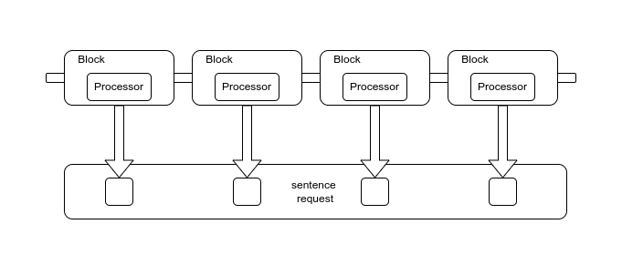

# Pipeline

In the examples before we have used the pipeline without introducing it. It needed some examples to get the idea.

A __pipeline__ is a sequence of steps that process the sentence from tokenization to response. It was popularized by the [Core Language Engine](https://mitpress.mit.edu/9780262512091/the-core-language-engine/) in 1992. The alternative to a processing pipeline is to perform several steps (parsing, semantic analysis, feasibility check) at the same time. A pipeline is more modular, simpler to build and easier to understand.

The pipeline in this library consists of __control blocks__, and each block contains a __processor__. These can be organized by the programmer.

## Processor

A __processor__ is an component that performs part of the sentence processing. An examples is the parser. Each of these works on the products of earlier processors in the pipeline and creates one or more alternative products. This forms the __ambiguity__ of the sentence. Next to the products, a processor may also return an error code, that is useful for debugging.

A processor produces a __ProcessResult__ that can have an error, indicating that the process failed, or one or more __Products__.

## Control block

A __control block__ is a control structure. It decides how to deal with alternative products. If you're satisfied to find the first successful interpretation of a sentence, choose the block `FindOne`. If on the other hand, you're looking for all possible interpretations, choose `FindAll`. You can select a different block per processing step, and you can define a new type of block.

A control block produces a __BlockResult__ which may contain an error. If it does, this indicates that the block failed.

The control block implements __ambiguity resolution__. Ambiguity, the phenomenon that a sentence may have more than one possible meaning, appears at different levels of processing. It allows each processor to produce multiple alternative readings to the same input. Each of these alternatives will then be tried with the rest of the pipeline.

If a processor yields multiple results, these need not be processed separately by the control block. Only if the results are different interpretations (ambiguous variants) it is useful to treat them as separate products. Otherwise the product just consists of an array of results.

## Sentence request

Each new input sentence is placed in an object, a `SentenceRequest`, and passed through all processors. Each processor takes the products of one or more previous processors, which are stored in this request, and stores its own product in the request as well.

## Dependencies

Most processors depend on other processors. This dependency is expressed by passing references to these dependent processors to the constructor of the processor. By making the dependencies explicit you will be less inclined to put the processors in the wrong order.
