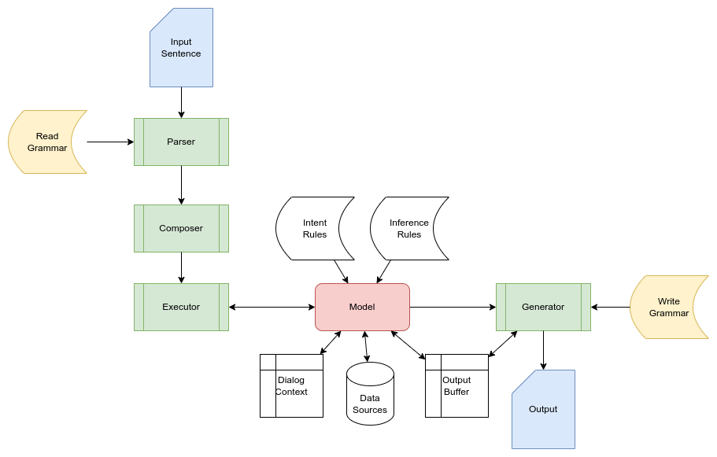

# System

The system integrates all combines all the parts needed to process a sentence:

* the model
* the input pipeline
* the output generator

This is a common structure:

~~~python
system = System(
    model=model,
    input_pipeline=[
        TryFirst(parser),
        TryFirst(composer),
        TryFirst(executor),
    ],
    output_generator=generator
)
~~~

All parts can be configured and subclassed to your needs.

## Data flow

This diagram shows how the components in the system are connected.

## Basic workflow

This is how to enter a sentence and retrieve an answer

~~~python
system.enter(SentenceRequest("Hello world"))
output = system.read_output()
~~~

