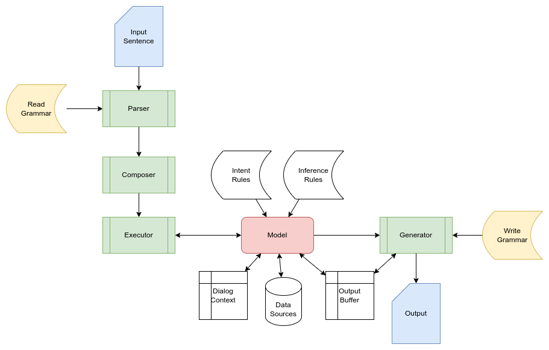

# System

The system integrates all combines all the parts needed to process a sentence:

* the model
* the parser
* the composer
* the executor
* the input pipeline
* the output generator
* the logger

This is a common structure:

~~~python
system = BasicSystem(
    model=model,
    parser=parser,
    composer=composer,
    executor=executor,
    output_generator=generator,
    logger=logger
)
~~~

All parts can be configured and subclassed to your needs.

## Data flow

This diagram shows how the components in the system are connected.

## Basic workflow

This is how to enter a sentence and retrieve an answer

~~~python
system.enter(SentenceRequest("Hello world"))
output = system.read_output()
~~~

## Customization

If you're not happy with the basic system, you can create your own. Make sure it extends `SomeSystem`.
